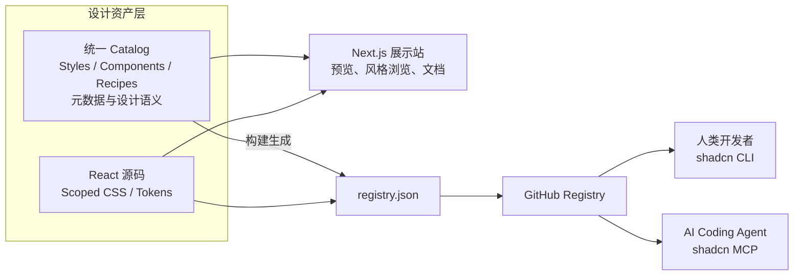

# 架构决策

**适用版本：** v0.1 / MVP 探索阶段

> 产品原则以 [`PROJECT_BRIEF.md`](./PROJECT_BRIEF.md) 为准。本文件记录在这些原则下做出的技术与切入决策。两者冲突时，以 `PROJECT_BRIEF.md` 为准，并同步修正本文件。

## 0. 架构目标

VariaUI 不是在建一个漂亮的组件展示网站，而是在建设一个**持续积累、可以被开发者和 AI Agent 共同使用的开源设计资产库**。

展示网站的核心是网页；设计资产库的核心是可复用的代码、风格体系和设计知识。官网只是这些资产的一个消费者。

第一条工程原则：

> **Collection-first in product experience. Component-first in code distribution.**

产品体验上，以完整的风格集合吸引用户；工程实现上，每个组件独立、可安装、可复用。

## 1. 首个切入方向

### Modern Bauhaus

**Collection 001 · Functional geometry. Bold typography. Deliberate composition.**

起始设计方向：以暖纸色和黑色为底色，红、蓝、黄作为克制的结构性强调色。大字、强网格、非对称布局、清晰边界，避免为了装饰而装饰。具体颜色和字体需要在实际组件中验证。

**包豪斯不等于红黄蓝三个圆圈加粗体字。** 真正重要的是构图、网格，以及形式与功能之间的关系。实现时要主动避开色彩、字形和几何上的刻板印象。

选择它的理由：

1. 辨识度强，几何、字体、网格与色彩容易形成明确的视觉语言。
2. 适合工程化，多数效果可用 CSS Grid、排版、边框、基础 SVG 和设计变量实现，不依赖 3D 或重动画。
3. 能检验核心差异化：一套风格规范能否让多个区块保持协调。
4. 素材依赖可控，可以先用自制几何构图，减少对摄影素材的依赖。

Modern Bauhaus 是**首个实验方向，不是永久产品定位**。是否有外部需求，要靠安装和复用数据验证。

### 首个产品场景

**Modern Bauhaus × 独立开发者 / 创意工作室作品集首页。**

作品集首页天然需要 Hero、项目展示和内容区块，适合验证组件之间的视觉协调性。不做「适用于所有网站的包豪斯组件」。

**先做出完整页面，再拆分成可独立安装的组件。这个顺序不能反过来。**

## 2. 技术选型

**单仓库 + Next.js 展示站 + shadcn Registry + 风格语义元数据**，采用模块化单体（Modular Monolith），不在一开始搭 Monorepo。

| 层次 | 选型 | 理由 |
| --- | --- | --- |
| 展示站 | Next.js 16（App Router）+ React + TypeScript | 与现有技术栈一致 |
| 样式 | Tailwind CSS v4 + CSS Modules | 灵活，便于隔离风格 |
| 基础交互 | shadcn/ui + Radix | 不重造基础原语 |
| 动效 | CSS 优先，必要时 Motion | 减少运行依赖 |
| 分发 | shadcn GitHub Registry | 开源、源码直装，无需自建 Registry 服务 |
| 元数据 | TypeScript / JSON 静态目录 | 暂不需要数据库 |
| 测试 | Vitest + Playwright | 行为、响应式与视觉验证 |
| 部署 | Vercel | 复用现有部署经验 |
| AI 集成 | Registry + 设计元数据，后续接 shadcn MCP | 不自研 Agent 系统 |

## 3. 资产流向



三个必须坚持的决策：

1. **Catalog 是产品的核心资产。** 每个组件描述自己的风格、场景、依赖和搭配关系。官网和 Registry 都读取同一份信息。
2. **展示与分发共用源码。** 不维护「展示版」和「正式版」两套代码。避免官网漂亮、用户装到的却是另一套实现。
3. **不把 Next.js 强加给组件使用者。** 可分发组件不依赖 `next/image`、`next/link` 等框架特性，保证能在其他 React 项目中复用。

## 4. 仓库结构

```text
VariaUI/
├── src/
│   ├── app/                       # Next.js 展示站（资产的消费者）
│   │   ├── page.tsx               # 首页
│   │   ├── styles/[slug]/         # 风格展厅
│   │   ├── components/[slug]/     # 组件详情
│   │   ├── recipes/[slug]/        # 完整搭配案例
│   │   └── preview/               # 独立预览页面
│   ├── catalog/                   # 统一元数据
│   │   ├── styles.ts
│   │   ├── components.ts
│   │   └── recipes.ts
│   ├── registry/                  # 真正可分发的源码
│   │   └── modern-bauhaus/
│   └── lib/                       # 展示站内部工具
├── scripts/
│   └── generate-registry.ts       # 从 Catalog 生成 registry.json
├── tests/
├── public/
├── registry.json                  # 分发入口（生成后提交）
├── README.md
├── PROJECT_BRIEF.md
├── ARCHITECTURE.md
├── CONTRIBUTING.md
└── LICENSE
```

这是目标结构，按里程碑逐步创建，不提前生成空目录。真正的源码在 `src/registry`。等确实需要独立 npm 包、多应用构建或多框架实现时，再考虑拆分为 Monorepo。

## 5. 领域模型

| 实体 | 含义 | 示例 |
| --- | --- | --- |
| Style | 一种审美体系，包含色彩、字体、几何、布局、图像和动效规则 | `modern-bauhaus` |
| Component | 独立可安装的设计作品，记录用途、主要风格、依赖和源码 | `bauhaus-manifesto-hero` |
| Recipe | 将多个组件组合成一个协调网页，不重复实现组件 | `bauhaus-portfolio` |

Recipe 表达的是「我有这样一套设计语言，你可以用它打造这种网站」，而不只是「我有一个 Hero」。

元数据示例（领域模型草稿，不是最终 Schema）：

```ts
export const manifestoHero = {
  id: "bauhaus-manifesto-hero",
  style: "modern-bauhaus",
  category: "hero",
  intent: "Bold, geometric, editorial landing hero",
  useCases: ["creative portfolio", "independent studio", "product launch"],
  traits: ["asymmetric grid", "oversized typography", "primary-color accents"],
  recommendedWith: ["bauhaus-project-grid", "bauhaus-section-index"],
  avoidWith: ["heavy glassmorphism", "neon gradients"],
  status: "experimental",
} as const;
```

这份信息有三个消费者：官网（说明、筛选、搭配建议）、Registry（描述与依赖）、Agent（结构化的设计选择依据）。

AI 能安装组件只是技术能力；**AI 能理解什么时候该用这个组件，才是产品目标。** Catalog 的语义信息是这个目标的基础。

## 6. 多风格样式隔离

**Style-scoped Tokens + Self-contained Components。**

- 每个 Style 拥有自己带前缀的 CSS 变量（如 `--mb-*`、`--outdoor-*`），定义在该风格的 CSS Module 作用域内，不写入全局。
- 同一风格的组件共享一个主题文件，Registry 安装组件时把主题文件作为依赖一起安装，不要求用户手动往 `globals.css` 复制变量。
- 不使用全局 Theme Provider 绑定整站风格。同一页面应允许有意识地组合不同风格的区块。
- 组件不得修改用户的全局样式，也不得污染其他 Collection。

```css
/* src/registry/modern-bauhaus/theme.module.css */
.root {
  --mb-bg: #f3efe4;
  --mb-fg: #171717;
  --mb-accent: #ce3b2a;
  --mb-border: 2px solid #171717;

  background: var(--mb-bg);
  color: var(--mb-fg);
}
```

CSS Modules 通过 shadcn Registry 分发、并与 Tailwind v4 共存的具体做法，需要在 Milestone 2 的安装测试中验证。

## 7. 首个 Collection：Modern Bauhaus / Creative Portfolio

第一批组件不超过三个：

| 组件 | 描述 | 适用场景 |
| --- | --- | --- |
| `bauhaus-manifesto-hero` | 整页视觉中心：粗体宣言、偏移网格、几何结构、克制的强调色 | 个人主页、设计工作室、产品介绍首页 |
| `bauhaus-project-grid` | 非对称项目展示：数字编号、标题、类别、强对比边界、不同尺寸卡片 | 作品集、案例展示、创意项目目录 |
| `bauhaus-section-index` | 借鉴书籍目录、展览索引、建筑图纸的编号结构 | 服务介绍、文章目录、产品能力、FAQ |

不从按钮和 Navbar 开始：普通导航用现有组件按视觉规范调整即可，不为凑数单独发布。

三者组合成首个 Demo：**Bauhaus Portfolio Recipe**。用户看到它，应当理解这是一个能拼出完整网站的风格集合，而不是互不相关的视觉特效。

## 8. 入库质量门槛

| 检查项 | 首版要求 |
| --- | --- |
| 源码复用 | 展示与安装使用同一份源代码 |
| 可安装性 | 在干净的 React / Next.js 示例项目中安装成功 |
| 响应式 | 检查手机、平板和桌面断点 |
| 可访问性 | 语义结构、键盘操作、对比度、`prefers-reduced-motion` |
| 隔离性 | 不修改用户全局样式，不污染其他 Collection |
| 来源 | 代码、图片、字体和图标的许可明确 |
| 性能 | 不引入不必要的运行依赖 |
| AI 可读性 | 清楚描述用途、设计意图及依赖 |

可安装性是最关键的一项：用户无法在自己项目里顺利复用，官网再漂亮也只是设计作品集。

## 9. 里程碑

1. **完成一个视觉作品。** 确定 Modern Bauhaus 设计规则，完成 `bauhaus-manifesto-hero`，确认响应式。不做完整官网和搜索。
2. **证明组件可复用。** 为 Hero 设计合理参数，接入 GitHub Registry，在另一个全新项目中安装成功，完成第一个技术闭环。
3. **完成第一个风格集合。** 实现 Project Grid 和 Section Index，组合成 Bauhaus Portfolio Recipe，验证风格一致性。
4. **公开最小展厅。** 首页、风格页、组件详情页，提供真实预览、源码与安装说明。
5. **验证 AI 使用价值。** 把 Registry 暴露给编程 Agent，对比使用与不使用组件库时的生成效果和修改成本，据此决定是否继续投入 AI 语义检索。

第一阶段完成后，不急着写第四个包豪斯组件，而是做一个视觉语言差异足够大的第二风格切片（如 Outdoor 或 Bohemian）。只有第二套截然不同的风格也能顺畅进入同一套架构，才能证明 VariaUI 是 Style-first 组件库，而不是一个包豪斯主题网站。

## 10. 决策记录

| 决策 | 选择 | 不选 |
| --- | --- | --- |
| 产品切入 | Modern Bauhaus Portfolio | 全风格同时开发 |
| 最小交付物 | 3 个组件 + 1 个完整 Recipe | 100 个孤立组件 |
| 仓库 | 单仓库，模块化目录 | 立即拆成复杂 Monorepo |
| 内容核心 | Style + Component + Recipe | 只有按功能分类的组件列表 |
| 代码分发 | GitHub Registry | 自建 Registry 后端 |
| 主题方案 | 局部作用域设计变量 | 强制全局主题 |
| AI 能力 | 语义元数据 + 现成 MCP | 自研 AI Agent 平台 |
| 数据存储 | 静态文件 | PostgreSQL + 后台 |
| 盈利系统 | 暂时不做 | 早期付费会员和组件市场 |

## 11. 展示站的视觉立场

展示站自身保持中性、克制的视觉语言。不因为首个系列是包豪斯，就把整个平台设计成包豪斯；否则后续加入侘寂、波西米亚等风格时，展厅的视觉层次会混乱。风格属于组件和 Recipe，不属于平台外壳。
